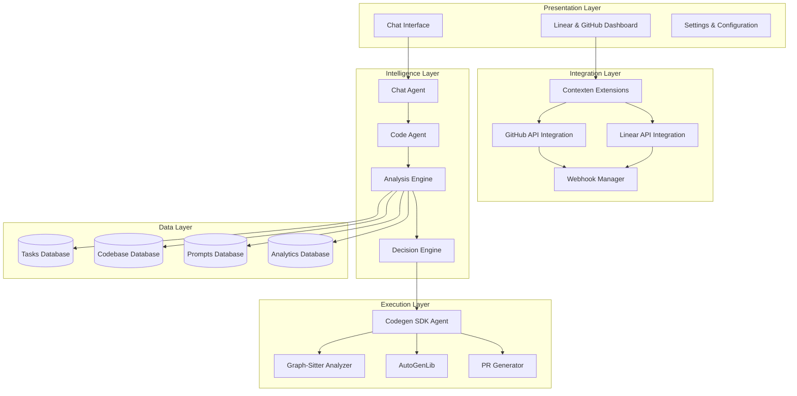

# Self-Evolving CI/CD Software Development System Architecture

## Overview

This document outlines the high-level architecture for a self-evolving CI/CD software development system that combines Linear project management, GitHub integration, comprehensive codebase analysis, and automated improvement capabilities.

## System Architecture

### 🏗️ Core Architecture Layers



## 📊 Database Schema Architecture

### Tasks Management Schema

```sql
-- Core task management tables
CREATE TABLE tasks (
    id UUID PRIMARY KEY,
    title VARCHAR(255) NOT NULL,
    description TEXT,
    status task_status_enum,
    priority INTEGER,
    complexity_score FLOAT,
    parent_task_id UUID REFERENCES tasks(id),
    codebase_id UUID REFERENCES codebases(id),
    created_at TIMESTAMP DEFAULT NOW(),
    updated_at TIMESTAMP DEFAULT NOW()
);

CREATE TABLE subtasks (
    id UUID PRIMARY KEY,
    parent_task_id UUID REFERENCES tasks(id),
    title VARCHAR(255) NOT NULL,
    status task_status_enum,
    order_index INTEGER,
    created_at TIMESTAMP DEFAULT NOW()
);

CREATE TABLE task_dependencies (
    id UUID PRIMARY KEY,
    task_id UUID REFERENCES tasks(id),
    depends_on_task_id UUID REFERENCES tasks(id),
    dependency_type dependency_type_enum
);
```

### Codebase Management Schema

```sql
-- Codebase tracking and analysis
CREATE TABLE codebases (
    id UUID PRIMARY KEY,
    name VARCHAR(255) NOT NULL,
    github_url VARCHAR(500),
    linear_project_id VARCHAR(255),
    requirements_md TEXT,
    webhook_secret VARCHAR(255),
    last_analyzed_at TIMESTAMP,
    created_at TIMESTAMP DEFAULT NOW()
);

CREATE TABLE codebase_files (
    id UUID PRIMARY KEY,
    codebase_id UUID REFERENCES codebases(id),
    file_path VARCHAR(1000) NOT NULL,
    file_type VARCHAR(50),
    lines_of_code INTEGER,
    complexity_score FLOAT,
    last_modified TIMESTAMP
);

CREATE TABLE codebase_functions (
    id UUID PRIMARY KEY,
    codebase_id UUID REFERENCES codebases(id),
    file_id UUID REFERENCES codebase_files(id),
    function_name VARCHAR(255),
    function_signature TEXT,
    start_line INTEGER,
    end_line INTEGER,
    cyclomatic_complexity FLOAT,
    halstead_volume FLOAT,
    call_count INTEGER,
    is_recursive BOOLEAN DEFAULT FALSE,
    is_dead_code BOOLEAN DEFAULT FALSE
);
```

### Analytics & Metrics Schema

```sql
-- Comprehensive code analytics
CREATE TABLE code_metrics (
    id UUID PRIMARY KEY,
    codebase_id UUID REFERENCES codebases(id),
    metric_type metric_type_enum,
    metric_value FLOAT,
    file_path VARCHAR(1000),
    function_name VARCHAR(255),
    calculated_at TIMESTAMP DEFAULT NOW()
);

CREATE TABLE dependency_graph (
    id UUID PRIMARY KEY,
    codebase_id UUID REFERENCES codebases(id),
    source_symbol VARCHAR(255),
    target_symbol VARCHAR(255),
    dependency_type dependency_type_enum,
    file_path VARCHAR(1000)
);

CREATE TABLE analysis_results (
    id UUID PRIMARY KEY,
    codebase_id UUID REFERENCES codebases(id),
    analysis_type analysis_type_enum,
    results JSONB,
    recommendations TEXT[],
    impact_radius JSONB,
    created_at TIMESTAMP DEFAULT NOW()
);
```

## 🔄 System Components

### 1. Dashboard & Interface Layer

#### Linear & GitHub Dashboard
- **Project Selection**: Browse 150+ GitHub projects via contexten extensions
- **Project Management**: Pin/unpin projects, view PR/branch status
- **Quick Diff View**: Compare main branch with PRs/branches
- **Requirements Management**: Create and edit REQUIREMENTS.md files
- **Webhook Integration**: Real-time updates from GitHub events

#### Chat Interface
- **Anthropic Integration**: Conversational AI powered by Claude
- **Context-Aware**: Uses code_agent.py for codebase analysis
- **Prompt Generation**: Intelligent prompt creation based on context
- **Codegen SDK Integration**: Direct integration with Codegen API

### 2. Analysis Engine

#### Graph-Sitter Integration
```python
from graph_sitter import Codebase
from codegen.sdk.core.external_module import ExternalModule
from codegen.sdk.core.import_resolution import Import
from codegen.sdk.core.symbol import Symbol

def get_comprehensive_codebase_context(codebase: Codebase) -> dict:
    """Extract comprehensive codebase analysis using graph-sitter."""
    
    analysis = {
        "overview": {
            "total_files": len(codebase.files),
            "total_functions": len(codebase.functions),
            "total_classes": len(codebase.classes),
            "total_imports": len(codebase.imports)
        },
        "complexity_metrics": calculate_complexity_metrics(codebase),
        "dependency_graph": build_dependency_graph(codebase),
        "code_quality": analyze_code_quality(codebase),
        "dead_code": find_dead_code(codebase),
        "function_analysis": analyze_all_functions(codebase)
    }
    
    return analysis

def analyze_all_functions(codebase: Codebase) -> list:
    """Analyze all functions with full context."""
    function_analyses = []
    
    for function in codebase.functions:
        context = get_function_context(function)
        metrics = calculate_function_metrics(function)
        
        function_analyses.append({
            "function": function.name,
            "context": context,
            "metrics": metrics,
            "recommendations": generate_recommendations(function, context, metrics)
        })
    
    return function_analyses
```

#### Comprehensive Code Metrics
- **Lines of Code (LOC)**: Total, logical (LLOC), and source (SLOC)
- **Cyclomatic Complexity**: Measure of code complexity
- **Halstead Volume**: Operator/operand complexity analysis
- **Depth of Inheritance (DOI)**: Class hierarchy analysis
- **Maintainability Index**: Overall code maintainability score
- **Dead Code Detection**: Unused functions and variables
- **Import Analysis**: Problematic imports and circular dependencies

### 3. Intelligence & Decision Layer

#### Automated Analysis Pipeline
```python
from codegen import Agent

class SelfEvolvingAnalyzer:
    def __init__(self, org_id: str, token: str):
        self.agent = Agent(org_id=org_id, token=token)
        self.codebase_analyzer = CodebaseAnalyzer()
    
    async def analyze_and_improve_codebase(self, codebase_id: str) -> dict:
        """Main analysis and improvement pipeline."""
        
        # 1. Load codebase context
        codebase = await self.load_codebase(codebase_id)
        context = get_comprehensive_codebase_context(codebase)
        
        # 2. Identify improvement opportunities
        issues = self.identify_issues(context)
        
        # 3. Generate improvement tasks
        tasks = await self.generate_improvement_tasks(issues, context)
        
        # 4. Execute improvements via Codegen SDK
        results = []
        for task in tasks:
            result = await self.execute_improvement_task(task, codebase)
            results.append(result)
        
        # 5. Create PR with improvements
        pr_result = await self.create_improvement_pr(results, codebase)
        
        return {
            "analysis": context,
            "improvements": results,
            "pr": pr_result
        }
    
    async def execute_improvement_task(self, task: dict, codebase: Codebase) -> dict:
        """Execute a single improvement task using Codegen SDK."""
        
        prompt = self.build_improvement_prompt(task, codebase)
        
        # Use Codegen SDK to implement the improvement
        agent_task = self.agent.run(prompt=prompt)
        
        # Wait for completion
        while agent_task.status != "completed":
            await asyncio.sleep(5)
            agent_task.refresh()
        
        return {
            "task": task,
            "result": agent_task.result,
            "status": agent_task.status
        }
```

### 4. Automation & Execution Layer

#### AutoGenLib Integration
```python
from autogenlib import CodeGenerator, AnalysisEngine

class AutoGenLibIntegration:
    def __init__(self, codegen_agent: Agent):
        self.codegen_agent = codegen_agent
        self.code_generator = CodeGenerator()
        self.analysis_engine = AnalysisEngine()
    
    def generate_improvements_with_context(self, codebase_context: dict) -> list:
        """Generate code improvements using AutoGenLib with graph-sitter context."""
        
        improvements = []
        
        # Analyze dead code
        for dead_function in codebase_context.get("dead_code", []):
            improvement = self.code_generator.generate_removal_task(dead_function)
            improvements.append(improvement)
        
        # Analyze complex functions
        for function_analysis in codebase_context.get("function_analysis", []):
            if function_analysis["metrics"]["complexity"] > 10:
                improvement = self.code_generator.generate_refactor_task(function_analysis)
                improvements.append(improvement)
        
        # Analyze import issues
        for import_issue in codebase_context.get("import_issues", []):
            improvement = self.code_generator.generate_import_fix(import_issue)
            improvements.append(improvement)
        
        return improvements
```

## 🔧 Implementation Strategy

### Phase 1: Foundation (Weeks 1-4)
1. **Database Setup**: Implement core database schemas
2. **Basic Integration**: Linear and GitHub API connections
3. **Graph-Sitter Integration**: Basic codebase analysis
4. **Dashboard MVP**: Simple project selection and viewing

### Phase 2: Analysis Engine (Weeks 5-8)
1. **Comprehensive Metrics**: Implement all code quality metrics
2. **Dependency Analysis**: Build dependency graph generation
3. **Dead Code Detection**: Automated unused code identification
4. **Analysis Storage**: Store results in analytics database

### Phase 3: Intelligence Layer (Weeks 9-12)
1. **Codegen SDK Integration**: Automated improvement generation
2. **AutoGenLib Integration**: Enhanced code generation capabilities
3. **Decision Engine**: Automated improvement prioritization
4. **Chat Interface**: Conversational AI for codebase interaction

### Phase 4: Automation & Evolution (Weeks 13-16)
1. **Automated PR Generation**: Self-improving code changes
2. **Feedback Loops**: Learn from PR acceptance/rejection
3. **Continuous Monitoring**: Real-time codebase health tracking
4. **Self-Evolution**: System improves its own analysis capabilities

## 🔄 Self-Evolution Mechanisms

### Learning from Outcomes
```python
class EvolutionEngine:
    def __init__(self):
        self.improvement_history = []
        self.success_patterns = {}
    
    def learn_from_pr_outcome(self, pr_data: dict, outcome: str):
        """Learn from PR acceptance/rejection to improve future suggestions."""
        
        pattern = self.extract_pattern(pr_data)
        
        if outcome == "merged":
            self.success_patterns[pattern] = self.success_patterns.get(pattern, 0) + 1
        else:
            self.success_patterns[pattern] = self.success_patterns.get(pattern, 0) - 1
    
    def get_improvement_confidence(self, proposed_improvement: dict) -> float:
        """Calculate confidence score for proposed improvement."""
        
        pattern = self.extract_pattern(proposed_improvement)
        success_rate = self.success_patterns.get(pattern, 0)
        
        return min(max(success_rate / 10.0, 0.0), 1.0)
```

### Adaptive Analysis
- **Pattern Recognition**: Learn successful improvement patterns
- **Context Adaptation**: Adjust analysis based on project type
- **Metric Weighting**: Dynamically adjust metric importance
- **Threshold Optimization**: Self-tune complexity thresholds

## 🔐 Security & Safety

### Code Change Validation
- **Automated Testing**: Run test suites before PR creation
- **Static Analysis**: Security vulnerability scanning
- **Human Review**: Configurable approval workflows
- **Rollback Mechanisms**: Quick reversion of problematic changes

### Data Protection
- **Encrypted Storage**: All sensitive data encrypted at rest
- **Access Controls**: Role-based permissions for different operations
- **Audit Logging**: Complete audit trail of all system actions
- **Privacy Compliance**: GDPR/SOC2 compliant data handling

## 📈 Monitoring & Observability

### System Health Metrics
- **Analysis Performance**: Time to analyze codebases
- **Improvement Success Rate**: PR merge rates
- **System Reliability**: Uptime and error rates
- **Resource Utilization**: CPU, memory, and storage usage

### Business Metrics
- **Code Quality Trends**: Improvement in maintainability scores
- **Developer Productivity**: Reduced time on code reviews
- **Bug Reduction**: Fewer production issues
- **Technical Debt**: Reduction in complexity metrics

## 🚀 Deployment Architecture

### Infrastructure Components
- **Container Orchestration**: Kubernetes for scalability
- **Message Queue**: Redis/RabbitMQ for async processing
- **Database**: PostgreSQL with read replicas
- **Caching**: Redis for frequently accessed data
- **Monitoring**: Prometheus + Grafana for observability

### Scalability Considerations
- **Horizontal Scaling**: Multiple analysis workers
- **Database Sharding**: Partition by codebase/organization
- **CDN Integration**: Fast dashboard loading globally
- **Auto-scaling**: Dynamic resource allocation based on load

## 🎯 Success Metrics

### Technical KPIs
- **Analysis Accuracy**: 95%+ correct issue identification
- **Improvement Success**: 80%+ PR merge rate
- **Performance**: <5 minute analysis for typical repositories
- **Reliability**: 99.9% system uptime

### Business KPIs
- **Code Quality**: 30% improvement in maintainability scores
- **Developer Efficiency**: 25% reduction in code review time
- **Bug Prevention**: 40% reduction in production issues
- **Technical Debt**: 50% reduction in complexity metrics

## 🔮 Future Enhancements

### Advanced AI Capabilities
- **Multi-Modal Analysis**: Include documentation and comments
- **Predictive Analytics**: Forecast potential issues
- **Natural Language**: Generate human-readable explanations
- **Cross-Repository Learning**: Learn patterns across projects

### Extended Integrations
- **IDE Plugins**: Real-time suggestions in development environments
- **CI/CD Integration**: Automated quality gates
- **Slack/Teams**: Notifications and interactions
- **JIRA Integration**: Automatic ticket creation for issues

This architecture provides a comprehensive foundation for building a self-evolving CI/CD system that can autonomously analyze, understand, and improve codebases while maintaining full integration with existing development workflows.

