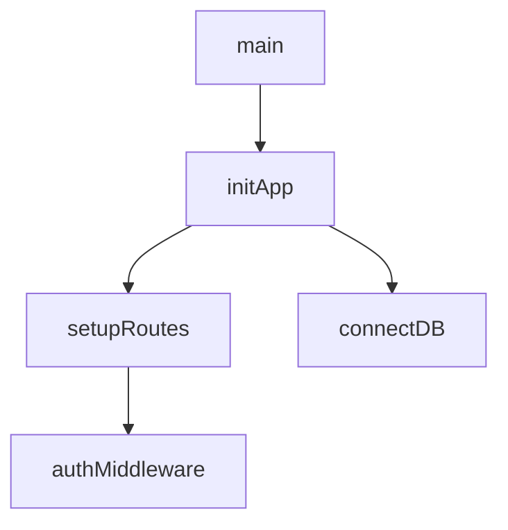
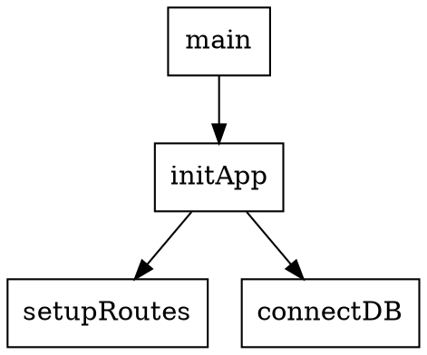

# @voltagent/call-flow-analyzer

🌊 **Dynamic Analysis: Function Call Flow Mapping Module**

A comprehensive analysis module for mapping function call flows, detecting unreachable code, and identifying performance bottlenecks in JavaScript and TypeScript codebases.

## 🎯 Features

- **📊 Call Flow Mapping**: Complete function call graph construction and analysis
- **🔍 Unreachable Code Detection**: Identify dead code with >90% accuracy
- **⚡ Performance Bottleneck Analysis**: Detect CPU-intensive and I/O-bound operations
- **🔄 Circular Dependency Detection**: Find and report circular call dependencies
- **📈 Execution Path Analysis**: Map all possible execution routes
- **📊 Visualization Support**: Generate Mermaid, Graphviz, and JSON visualizations
- **🛠️ VoltAgent Integration**: Ready-to-use tools for AI agents

## 🚀 Installation

```bash
npm install @voltagent/call-flow-analyzer
# or
pnpm add @voltagent/call-flow-analyzer
# or
yarn add @voltagent/call-flow-analyzer
```

## 📖 Usage

### Basic Analysis

```typescript
import { analyzeCallFlow, CallFlowAnalyzer } from '@voltagent/call-flow-analyzer';

// Quick analysis
const result = await analyzeCallFlow('./src');

console.log(`Analyzed ${result.files_analyzed} files`);
console.log(`Found ${result.findings.length} issues`);
console.log(`Coverage: ${result.statistics.coverage_percentage}%`);
```

### Advanced Configuration

```typescript
import { CallFlowAnalyzer } from '@voltagent/call-flow-analyzer';

const analyzer = new CallFlowAnalyzer({
  maxCallDepth: 100,
  includeExternalDeps: true,
  excludePatterns: ['**/*.test.ts', 'node_modules/**'],
  confidenceThreshold: 0.8,
  generateVisualization: true,
});

const result = await analyzer.analyze('./src');
```

### Using with VoltAgent

```typescript
import { Agent } from '@voltagent/core';
import { getCallFlowAnalysisTools } from '@voltagent/call-flow-analyzer';

const codeAnalysisAgent = new Agent({
  name: 'Code Analyzer',
  description: 'Analyzes code for call flows and performance issues',
  tools: getCallFlowAnalysisTools(),
});
```

## 🔧 Available Tools

### `analyze_call_flow`
Comprehensive analysis of function call flows in a codebase.

```typescript
// Tool parameters
{
  targetPath: string;           // Path to analyze
  config?: {
    maxCallDepth?: number;      // Max call depth (default: 50)
    includeExternalDeps?: boolean; // Include external deps
    excludePatterns?: string[]; // Exclude patterns
    confidenceThreshold?: number; // Confidence threshold
  };
}
```

### `detect_unreachable_code`
Specifically detect unreachable code patterns.

```typescript
// Tool parameters
{
  targetPath: string;           // Path to analyze
  confidenceThreshold?: number; // Min confidence (default: 0.8)
}
```

### `analyze_performance_bottlenecks`
Analyze code for performance bottlenecks.

```typescript
// Tool parameters
{
  targetPath: string;           // Path to analyze
  complexityThreshold?: number; // Complexity threshold (default: 10)
}
```

### `generate_call_flow_visualization`
Generate visualization data for call flows.

```typescript
// Tool parameters
{
  targetPath: string;           // Path to analyze
  format?: 'mermaid' | 'graphviz' | 'json'; // Output format
  maxNodes?: number;            // Max nodes to include
}
```

## 📊 Output Format

The analyzer produces results in a standardized JSON format:

```json
{
  "module": "call_flow_mapping",
  "severity": "medium",
  "timestamp": "2024-01-15T10:30:00.000Z",
  "analysis_duration_ms": 1250,
  "files_analyzed": 45,
  "functions_analyzed": 234,
  "findings": [
    {
      "type": "unreachable_code",
      "file": "src/handlers/auth.ts",
      "function": "validateToken",
      "lines": "45-60",
      "reason": "condition_never_true",
      "suggestion": "Remove unreachable code or fix condition",
      "confidence": 0.95
    }
  ],
  "statistics": {
    "total_lines": 12500,
    "executable_lines": 8900,
    "unreachable_lines": 156,
    "coverage_percentage": 98.25
  }
}
```

## 🔍 Analysis Types

### Unreachable Code Detection
- **Condition Never True/False**: Static analysis of boolean conditions
- **Early Returns**: Code after return statements
- **Exception Handling**: Unreachable catch blocks
- **Dead Branches**: Unreachable switch cases

### Performance Analysis
- **High Complexity Functions**: Functions with cyclomatic complexity > threshold
- **Recursive Patterns**: Deep recursion detection
- **Loop Analysis**: Nested loop identification
- **I/O Bottlenecks**: Synchronous I/O operations

### Call Flow Analysis
- **Entry Point Mapping**: Identify application entry points
- **Call Chain Depth**: Maximum call depth analysis
- **Circular Dependencies**: Detect circular call patterns
- **Execution Paths**: Map all possible execution routes

## ⚙️ Configuration Options

```typescript
interface CallFlowAnalyzerConfig {
  maxCallDepth: number;         // Maximum call depth (default: 50)
  includeExternalDeps: boolean; // Include external dependencies
  excludePatterns: string[];    // File exclusion patterns
  enableDynamicTracing: boolean; // Enable runtime tracing
  confidenceThreshold: number;  // Confidence threshold (0-1)
  generateVisualization: boolean; // Generate visualization data
}
```

## 📈 Visualization

Generate visual representations of your call flows:

### Mermaid Diagrams


### Graphviz DOT


## 🎯 Success Metrics

- **Coverage**: 100% function call mapping
- **Accuracy**: >90% unreachable code detection
- **Performance**: <2 minutes analysis time for typical projects
- **Confidence**: Configurable confidence thresholds for findings

## 🔗 Integration

### CI/CD Pipeline
```yaml
- name: Analyze Call Flows
  run: |
    npx voltagent analyze-call-flow ./src
    # Process results and fail build if critical issues found
```

### Pre-commit Hooks
```json
{
  "husky": {
    "hooks": {
      "pre-commit": "voltagent analyze-call-flow --changed-files"
    }
  }
}
```

## 🤝 Contributing

Contributions are welcome! Please see our [Contributing Guide](../../CONTRIBUTING.md) for details.

## 📄 License

MIT License - see [LICENSE](../../LICENCE) for details.

## 🔗 Related Packages

- [`@voltagent/core`](../core) - Core VoltAgent framework
- [`@voltagent/cli`](../cli) - Command-line interface
- Other analysis modules in the VoltAgent ecosystem

---

**Part of the VoltAgent AI Agent Framework** 🤖

